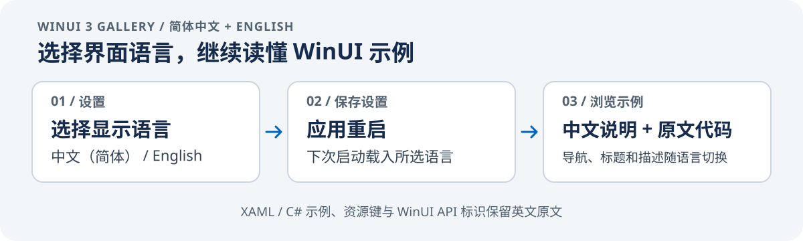

# WinUI 3 Gallery 中文双语版

<p align="center"><strong>为 WinUI 3 控件与 Fluent Design 示例补上简体中文说明，同时保留切回英文的入口。</strong></p>

<p align="center">
  <a href="https://github.com/microsoft/WinUI-Gallery">Microsoft 上游项目</a> ·
  <a href="https://github.com/ZiChen-Whisper/WinUI-Gallery-zh">本中文双语版</a> ·
  <a href="LICENSE">MIT License</a>
</p>



<p align="center"><strong>默认简体中文 · 可切换 English · 选择保存后应用重启生效</strong></p>

本仓库基于微软的 [WinUI 3 Gallery](https://github.com/microsoft/WinUI-Gallery)，面向想用中文学习 WinUI 控件和 Fluent Design 示例的开发者。界面和说明可以用简体中文阅读；切到英文时仍可对照上游术语与原始内容。

## 本版本汉化了什么

- **双语切换**：在应用的“设置 → 显示语言”中选择“中文（简体）”或 English。选择会保存在本机，重启应用后生效；新配置默认使用简体中文。
- **样例目录**：19 个分类、123 个示例的标题、副标题和说明均有中文；标题保留中英对照，方便查找上游文档和 API。
- **界面与示例文案**：主页、设置、导航、Color 等页面，以及多个示例页面和交互提示提供中文映射。未收录的文字回退到上游英文。
- **代码保持可用**：XAML/C# 示例、WinUI 控件名、API 标识符和资源键保留英文，便于复制运行并与微软文档对应。

翻译映射保存在 `WinUIGallery/Localization/`，语言选择逻辑位于 `WinUIGallery/Helpers/LocalizationHelper.cs` 和设置页代码中。原始示例与上游代码结构仍在同一项目内。

## 下载并运行

首个 x64 免安装版本已发布：[下载 WinUI-Gallery-zh-win-x64.zip](https://github.com/ZiChen-Whisper/WinUI-Gallery-zh/releases/latest/download/WinUI-Gallery-zh-win-x64.zip)。解压后运行 `WinUIGallery.exe`。程序默认显示简体中文；可在“设置 → 显示语言”切换到 English，重启后生效。

该压缩包是自包含构建，不需要另行安装 .NET 或 Windows App SDK。当前二进制仅面向 Windows x64；它没有代码签名，Windows 可能显示未知发布者提示。已在 Windows 11 x64（OS build 26100）完成构建和启动检查，其他系统版本和设备尚未验证。本项目是社区汉化版，不是微软官方发行版。

### 从源码构建

```powershell
git clone https://github.com/ZiChen-Whisper/WinUI-Gallery-zh.git
cd WinUI-Gallery-zh
```

使用 Visual Studio 2022 或更新版本打开 `WinUIGallery.slnx`，将 `WinUIGallery` 设为启动项目，还原 NuGet 依赖后构建并运行。需要安装 Visual Studio 的 **Windows application development** 工作负载；微软的[环境安装说明](https://learn.microsoft.com/windows/apps/get-started/start-here)列出了所需组件。

本项目沿用上游固定的实验版 Windows App SDK，版本定义在 `standalone.props`。实验 API 可能在未来版本变化或移除；项目将运行时随应用一起部署。上游 README 的构建提示和限制见下方中文译本。

### 当前验证记录

`Release-Unpackaged` x64 构建成功；从发布 ZIP 解压后启动，应用进程正常响应并创建主窗口。构建过程中有上游可空性和 XAML 裁剪兼容性警告，未报告编译错误。中英文切换以及 Color、ComboBox 等代表性页面此前做过手动检查；本次未逐一复核所有页面，也未运行自动化测试。其他 Windows 版本和设备尚未验证。

## 上游 README 中文翻译

以下内容翻译自微软上游仓库在本版本基础提交 [`7614c008`](https://github.com/microsoft/WinUI-Gallery/blob/7614c0083cc7fe33f5473603bb745a222abaef27/README.md) 中的 README。它保留了上游项目的介绍、资源链接和开发说明；其中的贡献指南、项目看板、商店发布流程及克隆命令指向微软上游仓库。构建本中文双语版请使用上面的仓库地址和步骤。

<p align="center">
  
</p>

## WinUI 3 Gallery

WinUI 3 与 Windows App SDK API 的配套示例应用。

此应用展示如何使用 Windows App SDK 构建现代 Windows 应用中提供的 WinUI 3 控件和样式。它是 [Fluent Design 指南](https://docs.microsoft.com/windows/apps/design/basics/)的交互式配套应用，通过交互示例、工具和代码片段演示 [WinUI](https://docs.microsoft.com/windows/apps/winui/) 的用法。

原版应用可从 [Microsoft Store](https://apps.microsoft.com/detail/9P3JFPWWDZRC?launch=true&mode=full) 获取。

<p align="center">
  <a href="https://apps.microsoft.com/detail/9P3JFPWWDZRC?launch=true&mode=full">
    <picture>
      <source media="(prefers-color-scheme: light)" srcset="./.github/assets/StoreBadge-dark.png" width="220" />
      
    </picture>
  </a>
</p>

### 功能

- **WinUI 控件示例**：每个控件页面都会展示构成示例的标记语言和代码后台。
- **使用 Microsoft.UI.Xaml（WinUI）库**：应用包含最新的 WinUI NuGet 包，并演示如何使用 [WinUI](https://docs.microsoft.com/windows/apps/winui/) 控件，例如 NavigationView、SwipeControl 等。
- **自适应界面**：除了展示控件如何响应不同设备形态，应用本身也支持自适应，并演示了多种实现方式。
- **设计与无障碍指南**：设计和无障碍页面让 Gallery 成为开发者的实用参考应用。

### 参与上游 WinUI Gallery

希望新增示例或改进文档？可以先在微软上游仓库[提交 Issue](https://github.com/microsoft/WinUI-Gallery/issues)讨论，也可以提交 Pull Request。

如果还不知道从哪里开始，可以查看标记为 [help wanted](https://github.com/microsoft/WinUI-Gallery/issues?q=is%3Aopen+is%3Aissue+label%3A%22help+wanted%22) 的待处理事项。也可以在[项目看板](https://github.com/orgs/microsoft/projects/368)了解上游进展。

### 上游项目的构建说明

#### 1. 准备开发环境

构建 WinUI Gallery 需要 [Visual Studio 2022](https://visualstudio.microsoft.com/vs/) 或更高版本；运行需要 Windows 10 或更高版本。如果你是第一次使用 WinUI 和 Windows App SDK 开发应用，请参阅微软的[安装说明](https://learn.microsoft.com/windows/apps/get-started/start-here)。

Visual Studio 所需组件：

- Windows application development（Windows 应用程序开发）

#### 2. 克隆微软上游仓库

以下命令保留上游 README 的原地址。如需获取本汉化版，请用上文的 `ZiChen-Whisper/WinUI-Gallery-zh` 地址。

```powershell
git clone https://github.com/microsoft/WinUI-Gallery.git
```

#### 3. 使用 Visual Studio 构建

用 Visual Studio 打开 `WinUIGallery.slnx`，确保 `WinUIGallery` 项目设为启动项目，然后构建。

Gallery 使用实验版 Windows App SDK 展示即将推出的功能。请使用普通的 `Debug` 或 `Release` 配置；SDK 版本固定在 `standalone.props`。运行时随应用一起部署（self-contained），而不是依赖系统中共享的 Windows App SDK 框架包。实验 API 在正式发布前可能会变化或移除。

**Windowing APIs** 页面同时包含稳定的窗口创建示例和实验性的窗口尺寸示例。每个实验示例都有独立标注和警告；稳定示例仍使用原有 API。

> **构建提示：** 上游 README 提到，如果遇到找不到 `WinUIGallery/obj/WinUIGallery/project.assets.json` 的错误，可以尝试删除 `nuget.config` 后重新还原和构建。详情见上游 [Issue #1659：Broken repo build](https://github.com/microsoft/WinUI-Gallery/issues/1659)。这是上游提供的排查提示；修改配置文件前请先阅读该 Issue，并确认问题与当前环境相符。

### 更多信息

了解 Windows 应用开发，请访问 [Windows Dev Center](https://developer.microsoft.com/windows)。微软上游的维护者可以查看[发布运行手册](https://github.com/microsoft/WinUI-Gallery/blob/main/docs/PublishingNewVersion.md)，了解如何协调 Microsoft Store 发布与 GitHub Release。

相关主题：

- [开始使用 WinUI](https://learn.microsoft.com/windows/apps/get-started/start-here)
- [关于 WinUI](https://aka.ms/windev)
- [WinUI 仓库](https://github.com/microsoft/microsoft-ui-xaml)
- [Windows App SDK 仓库](https://github.com/microsoft/WindowsAppSDK)
- [Windows App SDK 示例](https://github.com/microsoft/WindowsAppSDK-Samples)

### 上游贡献者

感谢微软 WinUI Gallery 的贡献者。查看[上游贡献者名单](https://github.com/microsoft/WinUI-Gallery/graphs/contributors)。

上游 README 中的贡献者图片由 [contrib.rocks](https://contrib.rocks) 提供。

## 许可证与来源

本仓库基于微软 [WinUI-Gallery](https://github.com/microsoft/WinUI-Gallery)，沿用其 [MIT License](LICENSE) 并保留原有版权声明。这里增加的中文翻译和双语显示代码是对上游应用的社区改造；本仓库不是微软发布或维护的官方中文版本。
